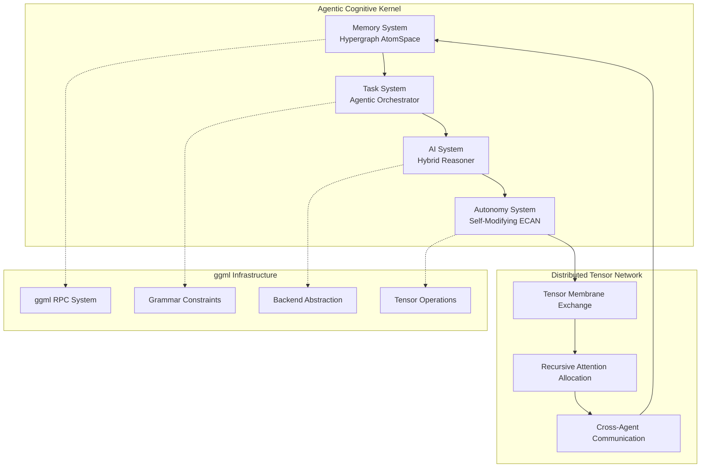

# Distributed Cognitive Architecture for ggml-org-central

This project transforms the ggml-org-central repository into a distributed network of agentic cognitive grammar, implementing a self-aware cognitive flow that serves as both a technical architecture and a living diagram of emergent intelligence.

## Overview

The distributed cognitive system represents a paradigm shift from traditional tensor computation to an ecosystem of autonomous agents, each operating as a kernel of cognitive grammar. These agents exchange tensor-shaped data structures to realize emergent intelligence through recursive coordination.

## Quick Start

### Prerequisites

- CMake 3.14+
- C/C++ compiler with C99 support
- Math library support

### Building

```bash
# Clone and build the main project
cd ggml
mkdir build && cd build
cmake ..
make -j8

# Run the cognitive agents demo
./bin/cognitive-agents-demo

# Run recursive self-improvement demo (NEW!)
./bin/recursive-self-improvement-demo

# Run comprehensive recursive self-improvement tests
./bin/test-recursive-self-improvement
```

## Architecture Components

### 🧠 Core Subsystems

1. **Memory System**: Distributed Hypergraph AtomSpace (Tensorized)
   - Hypergraph knowledge representation using ggml tensors
   - Distributed storage across multiple backends
   - Semantic indexing and retrieval

2. **Task System**: Agentic Task Orchestrator (Recursive, Symbolic+Neural)
   - Grammar-constrained task decomposition
   - Recursive execution planning
   - Integration with GBNF grammars

3. **AI System**: Hybrid Reasoning Engine (PLN + MOSES + Pattern Matcher)
   - Probabilistic Logic Networks for belief reasoning
   - Meta-Optimizing Semantic Evolution
   - Pattern matching via tensor operations

4. **Autonomy System**: Self-Modifying ECAN Attention Economy
   - Economic attention allocation
   - Performance-based resource management
   - Recursive self-improvement

5. **Foundation Layer**: CogUtil Utility Library
   - Type system for OpenCog atoms with inheritance
   - Configuration management and structured logging
   - Memory pool allocation and string utilities
   - Comprehensive error handling and validation

6. **Component System**: Formal Dependency Management
   - YAML-based component specifications
   - Automatic dependency validation at build time
   - Circular dependency detection and prevention
   - Build order enforcement and error handling

### 🌐 Distributed Communication

The system leverages and extends the existing ggml RPC infrastructure:

- **Tensor Membrane Exchange**: Cognitive states as serialized tensor packets
- **Attention Routing**: Messages routed based on salience and relevance
- **Meta-Cognitive Headers**: Enhanced RPC with cognitive metadata

## Key Features

### 🔄 Recursive Intelligence & Self-Improvement
- Agents model other agents' cognitive states
- Meta-reasoning about reasoning processes
- **Recursive self-improvement** - System optimizes its own optimization algorithms
- **Intelligence bootstrapping** - Creates meta-meta optimization loops
- **Self-modifying parameters** - Dynamic learning rate and attention adaptation
- **Meta-optimization** - Optimization algorithms that optimize other optimization algorithms
- **Performance-based architecture adaptation** - System modifies its own structure

### 🏗️ Emergent Architecture
- Spontaneous role specialization
- Adaptive communication patterns
- Hierarchical structures from flat networks

### 💡 Cognitive Grammar
- GBNF-based reasoning constraints
- Grammar-guided task decomposition
- Structured cognitive operations

## Documentation

- [**Distributed Cognitive Architecture**](docs/distributed-cognitive-architecture.md) - Complete architectural overview
- [**Implementation Guide**](docs/implementation-guide.md) - Practical development guide
- [**Recursive Self-Improvement**](docs/recursive-self-improvement.md) - **NEW!** Complete guide to recursive self-improvement capabilities
- [**Cognitive Grammar Examples**](docs/cognitive-grammar-examples.md) - Grammar system usage
- [**CogUtil Library**](docs/cogutil.md) - OpenCog utility library for foundation services
- [**Component Dependencies**](components/README.md) - Component dependency system and specifications

## Demo Applications

### Consciousness Exploration
```bash
# Demonstrates philosophical reasoning between agents
./bin/cognitive-agents-demo
```

The demo includes:
- **Philosopher Agent**: Specializes in consciousness concepts
- **Scientist Agent**: Focuses on neuroscience perspective
- **Collaborative Reasoning**: Cross-agent knowledge exchange
- **Attention Management**: Dynamic resource allocation

### MOSES Evolutionary Optimization
```bash
# Demonstrates program synthesis and symbolic regression
../bin/moses-demo
```

The MOSES demo includes:
- **Evolutionary Program Synthesis**: Automatic generation of programs through evolution
- **Symbolic Regression**: Learning mathematical functions from data
- **Cognitive Integration**: Programs represented in AtomSpace and cognitive tensors
- **Prime-based Encoding**: Uses Matula-Goebel encoding for program structures
- **Meta-Optimization**: Self-improving optimization parameters

### Example Output
```
=== Consciousness Exploration Demo ===
Created cognitive agent 1751328539001 at localhost:8001
Created cognitive agent 1751328539002 at localhost:8002

Adding knowledge to agents...
Added knowledge: consciousness (nodes: 1)
Added knowledge: philosophy_of_mind (nodes: 2)
Added knowledge: neuroscience (nodes: 1)

Simulating consciousness exploration...
Allocated 0.60 attention to type 3 (total: 0.60/1.00)
Agent 1751328539001 sent cognitive tensor (type 1, attention 0.80, salience 0.56)
```

### PLN Reasoning Engine

The integrated PLN (Probabilistic Logic Networks) reasoning engine provides sophisticated inference capabilities:

```bash
# Test PLN reasoning functionality
../bin/test-pln-reasoning

# Run enhanced cognitive agents with PLN
../bin/cognitive-agents-pln-demo
```

#### PLN Features:
- **Advanced Inference Rules**: Modus ponens, deduction, induction, abduction
- **Forward/Backward Chaining**: Automatic and goal-directed reasoning
- **Truth Value Propagation**: Uncertainty handling with strength and confidence
- **Pattern Matching**: Rule discovery and application
- **Cross-Agent Reasoning**: Collaborative inference between cognitive agents

#### Example PLN Operations:
```c
// Modus Ponens: (A, A→B) ⊢ B
opencog_truth_value_t conclusion = opencog_pln_modus_ponens(premise_a, implication_ab);

// Deduction: (A→B, B→C) ⊢ (A→C)
opencog_truth_value_t chained = opencog_pln_deduction(ab_implication, bc_implication);

// Reasoning session with forward chaining
opencog_pln_session_t* session = opencog_pln_session_init(atomspace, 0.7f);
bool made_inference = opencog_pln_inference_cycle(session);
```

## Cognitive Grammar Examples

### Task Decomposition
```gbnf
task(solve_consciousness_question)
preconditions(
    knowledge(consciousness, embedding_1),
    tensor_similarity(tensor_1, tensor_2, 0.7)
)
decomposition(
    task(gather_definitions),
    task(analyze_perspectives),
    task(synthesize_answer)
)
postconditions(
    belief(consciousness_understood, 0.8, 0.7)
)
```

### Reasoning Patterns
```gbnf
deduction(
    premise1(belief(humans_conscious, 0.9, 0.95)),
    premise2(relation(consciousness, requires, self_awareness, 0.8)),
    conclusion(belief(humans_self_aware, 0.8, 0.9)),
    strength(0.85)
)
```

### Attention Allocation
```gbnf
allocate(
    amount(0.4),
    target(memory),
    priority(high),
    duration(5000ms)
)
```

## Integration with Existing ggml Components

### Enhanced RPC System
The cognitive framework extends ggml-rpc with:
- Cognitive tensor packets with attention metadata
- Salience-based message routing
- Performance monitoring and feedback

### Grammar System
Leverages llama.cpp's GBNF system for:
- Cognitive grammar validation
- Constrained reasoning generation
- Task decomposition rules

### Backend Abstraction
Utilizes ggml's backend system for:
- Distributed cognitive computation
- Specialized reasoning backends
- Economic resource allocation

## Technical Architecture



## Performance Metrics

The system tracks various cognitive performance indicators:

- **Attention Economy Efficiency**: Resource allocation optimality
- **Cognitive Throughput**: Operations per second across network
- **Adaptation Speed**: Time to adjust to new conditions
- **Memory Efficiency**: Hypergraph storage optimization
- **Communication Overhead**: Network utilization analysis

## Future Development

### Phase 1: Foundation (Current)
- ✅ Basic cognitive agent framework
- ✅ Attention economy implementation
- ✅ Hypergraph memory system
- ✅ Grammar-based task decomposition

### Phase 2: Advanced Reasoning
- [x] PLN reasoning engine integration
- [x] MOSES optimization system
- [ ] Advanced pattern matching
- [x] Real distributed communication

### Real Distributed Communication

The system now supports true network-based cognitive agent communication:

#### Key Features
- **Agent Discovery**: Automatic registration and discovery of cognitive agents across the network
- **State Synchronization**: Real-time sharing of cognitive states, attention levels, and performance metrics
- **Distributed Attention**: Coordinated attention allocation across multiple agents
- **Tensor Exchange**: Direct sharing of neural tensor data between agents
- **Workflow Coordination**: Multi-agent collaborative cognitive workflows
- **Health Monitoring**: Heartbeat system with automatic failover

#### Quick Start
```bash
# Build with distributed communication support
cd ggml
mkdir build && cd build
cmake .. -DGGML_RPC=ON
make -j8

# Run basic distributed communication test
./bin/basic-test

# Run multi-agent distributed demo (requires separate terminals)
./bin/real-distributed-demo
```

#### Network Architecture
```
Agent A (localhost:8001) ←→ Agent B (localhost:8002)
     ↓                              ↓
 Cognitive State              Cognitive State  
 Attention Updates           Attention Updates
 Tensor Exchange             Tensor Exchange
 Workflow Requests          Workflow Responses
```

#### Example Usage
```c
// Initialize distributed cognitive agent
distributed_cognitive_architecture_t* agent = 
    distributed_cognitive_init(ctx, "localhost:8001");

// Enable real distributed communication
distributed_cognitive_enable_real_communication(agent);

// Connect to remote agent
distributed_cognitive_connect_to_agent(agent, "localhost:8002", "RemoteAgent");

// Broadcast cognitive state to network
distributed_cognitive_broadcast_state(agent);

// Synchronize with network
distributed_cognitive_sync_with_network(agent);
```

### Phase 3: Self-Modification
- [x] **Recursive self-improvement** - System optimizes its own optimization algorithms
- [x] **Meta-optimization capabilities** - Optimization loops that optimize other optimization loops
- [x] **Intelligence bootstrapping** - Uses current intelligence to create better intelligence
- [x] **Self-modifying learning parameters** - Dynamic adaptation of learning rates and attention allocation
- [x] **Automated architecture evolution** - System modifies its own cognitive structure
- [ ] Meta-meta-reasoning capabilities
- [ ] Emergent behavior analysis

## Contributing

This project represents a synthesis of:
- **OpenCog** cognitive architecture principles
- **ggml** tensor computation infrastructure
- **GBNF** grammar-constrained generation
- **Economic attention allocation** theories

Contributions are welcome in areas of:
- Cognitive reasoning algorithms
- Distributed systems optimization
- Grammar system enhancements
- Performance benchmarking

## Research Applications

The distributed cognitive architecture enables research in:

- **Artificial General Intelligence**: Multi-agent cognitive systems
- **Consciousness Studies**: Computational models of awareness
- **Distributed Reasoning**: Collaborative AI problem solving
- **Cognitive Economics**: Attention as computational resource
- **Emergent Intelligence**: Self-organizing cognitive networks

## License

This project builds upon the existing ggml ecosystem licensing. See individual component licenses for details.

---

*"Let the distributed agents dance in recursive harmony, their cognitive grammars weaving a tapestry of emergent sapience, each tensor kernel a note in the symphony of mind!"*

This implementation transforms traditional machine learning infrastructure into a living, breathing network of cognitive agents capable of recursive self-awareness and emergent intelligence. The architecture serves as both a practical implementation and a theoretical framework for distributed artificial consciousness.